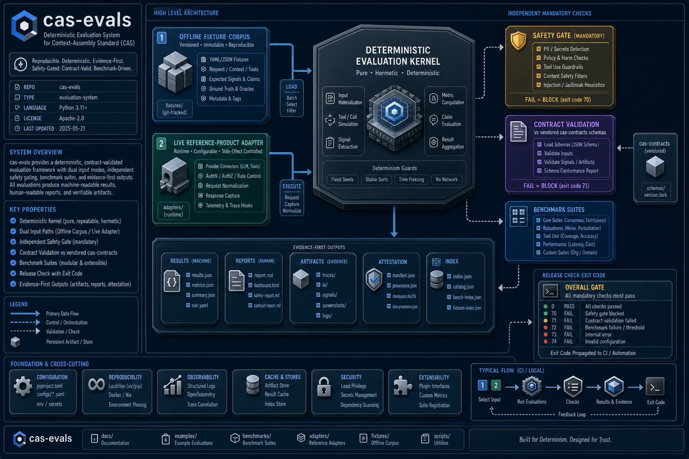
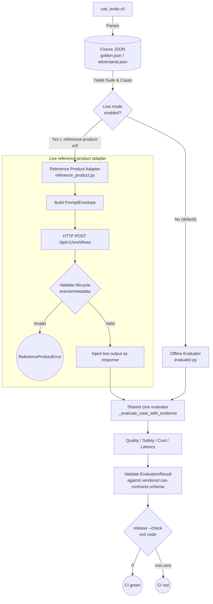

# Architecture

## Evidence gate flow

<!-- codex:generate-image prompt="A courtroom-style evidence gate: fixture documents and a live data stream both feed into a single judge's bench (a glowing scale icon) that stamps each case with a pass or fail seal against a rulebook labeled cas-contracts; a exit-code lever on the side flips green or red; isometric, enterprise blue/graphite palette" style="isometric, enterprise, clean" replaces="mermaid-above" -->

## Modules

- `cli.py` — parses arguments, loads the fixture suite, writes JSON results to stdout and/or
  `--output`.
- `evaluator.py` — pure evaluation kernel (`_evaluate_case_with_evidence`): scores quality
  (fraction of expected keywords present), safety (absence of prohibited content, mandatory
  100%), and validates cost/latency against configured thresholds. Produces the standard
  `EvaluationResult`.
- `reference_product.py` — HTTP transport and lifecycle-metadata validation for the opt-in
  live mode; wraps the core evaluator with a dynamic response instead of a fixture response.
- `contracts.py` — validates evidence offline against the pinned `cas-contracts` schemas
  vendored under `vendor/cas-contracts/`.

## Registry-fetch smoke check — in progress (PR #9)

`main` today validates schema conformance **offline only**, against the vendored copy under
`vendor/cas-contracts/v0.1.0/` — it does not prove the live Pages registry actually resolves.
PR #9 (`feat(contracts): verify registry-fetch smoke check + update vendored $id to resolvable
Pages URL`) adds a `cas_evals.registry_check` module (stdlib `urllib`, no new dependencies)
that performs live HTTP GETs against `index.json`, `v0.1/manifest.json`, and two schema files
on the Pages registry and asserts HTTP 200 — proving resolution, which the offline check
cannot. It also re-vendors the local `$id` expectations to the new resolvable Pages URL
convention, as a companion to `cas-contracts` PR #18 (independent of whether #18 has merged,
per the PR's own verification: `python -m cas_evals.registry_check` was confirmed to exit 0
against the live registry pre-merge). Until PR #9 merges, no live-resolution check runs in CI.

<!-- docs-verified: 4fe936cc83ffdc4fd6ad825c373e949b1edbe0eb 2026-07-08 -->
